---
puppeteer:
    format: "A4"
    displayHeaderFooter: true
    headerTemplate: '<div style="font-size:10px;width:100%;padding:0 40px;color:#555;"><span class="date"></span></div>'
    footerTemplate: '<div style="font-size:10px;width:100%;padding:0 40px;color:#555;text-align:right;"><span class="pageNumber"></span> / <span class="totalPages"></span></div>'
    margin:
        top: "70px"
        bottom: "70px"
        left: "40px"
        right: "40px"
    printBackground: true
    scale: 0.8
---


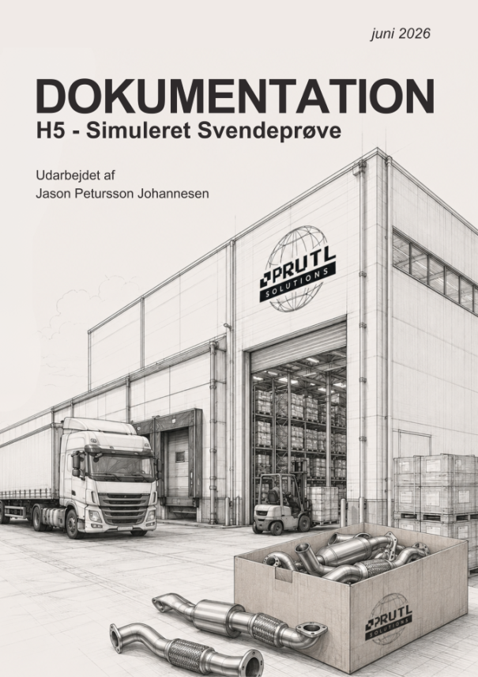

<div style="page-break-after: always;"></div>

## Index
1. [Indledning](#indledning)
2. [Serverteknologi - Cluster](#serverteknologi---cluster)
2.1 [Hypervisor - Proxmox](#hypervisor---proxmox)
2.2 [Netværk - LACP/Bond & Corosync](#netværk---lacpbond--corosync)
2.3 [Cluster & High Availability](#cluster--high-availability)
2.4 [Storage - Ceph](#storage---ceph)
2.4.1 [Installation](#installation)
2.4.2 [OSD opsætning](#osd-opsætning)
2.4.3 [RBD pool og CephFS storage](#rbd-pool-og-cephfs-storage)
3. [Backupteknologi](#backupteknologi)
3.1 [Veeam](#veeam)
3.2 [Proxmox Backup Server](#proxmox-backup-server)
4. [Cloudteknologi](#cloudteknologi)
4.1 [Saas - Atlassian](#saas---atlassian)
4.2 [IaaS - Azure / AWS / GCP](#iaas---azure--aws--gcp)
5. [Konklusion](#konklusion)

<div style="page-break-after: always;"></div>

## Indledning

Den her case har handlet op en virksomhed som vi har kaldt Prutl Solutions. De laver udstødningsrør til køretøjer.
Firmaet skulle forestille sig at være en SME på omkring 200 ansatte.

Vi har så lavet core infrastrukturen der skulle understøtte firmaet.
I den her dokumentation kommer jeg ikke til at tale om største delen af netværket. Jeg kommer kun til at tale om det der er i de orange kasser.

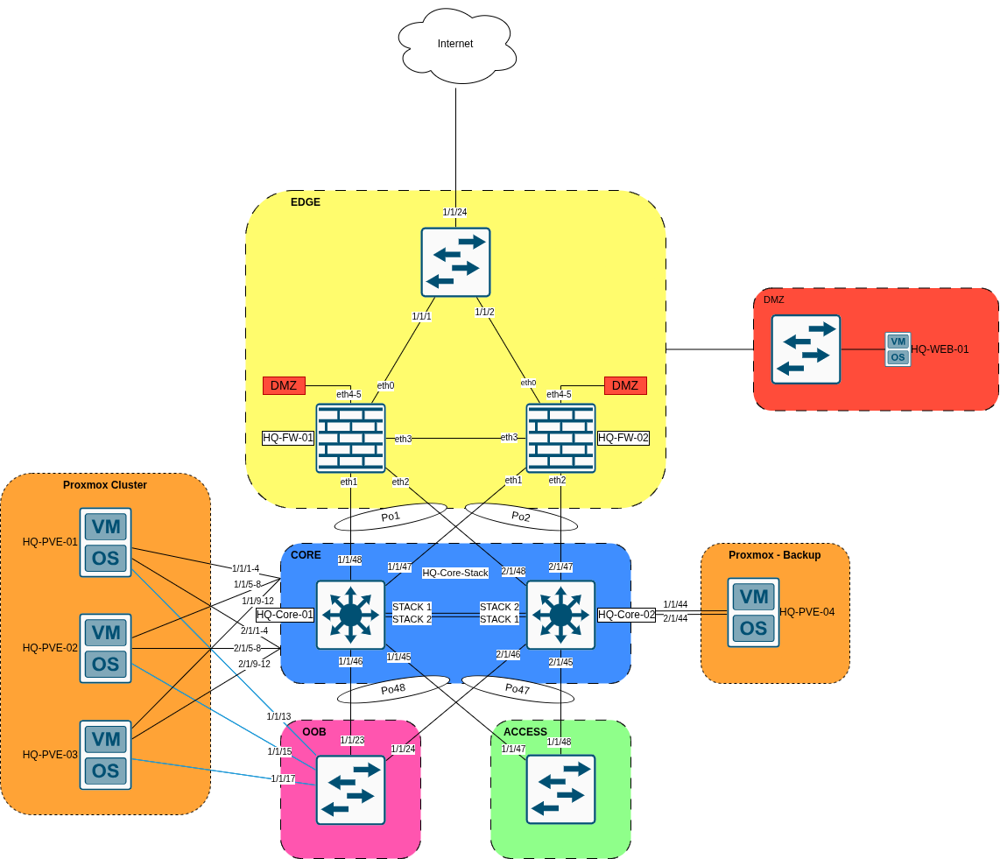

<div style="page-break-after: always;"></div>

## Serverteknologi - Cluster

### Hypervisor - Proxmox

Fordi vi har været begrænset af, at vi kun er blevet tildelt 3 SSD per server, så er vi blevet nødt til at installere Proxmox på en lidt speciel måde. Vi vil gerne have at systemet er så pålideligt som muligt under de begrænsede vilkår.

I den sammenhæng har vi valgt at installere Proxmox i et 3-way ZFS mirror på et partition på de første 64 GB på alle 3 diske. Det betyder at vi kan miste 2 af de 3 diske før det bliver et problem.

Her er et skærmbillede af diskene på en af Proxmox serverne.

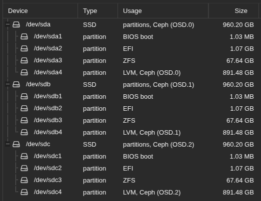

Hvis du åbner ZFS oversigten, så kan du se en rpool med et mirror på det tredje partition på diskene. `/dev/sda3`, `/dev/sdb3` og `/dev/sdc3`.

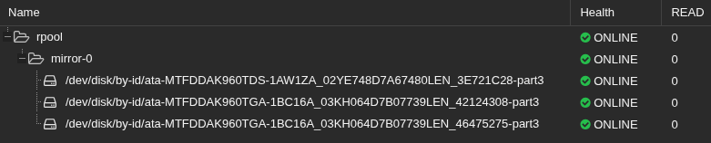

Vi kommer ikke til at bruge OS diskene til at gemme VM’er eller ISO filer, så de skal kun kunne håndtere opdateringer og logfiler af selve systemet. Alt andet bliver smidt på Ceph clusteret.

For initial setup på alle Proxmox serverne, før vi begynder at lave noget konfiguration, så kører vi et community script på alle serverne:

[PVE Post Install](https://community-scripts.org/scripts/post-pve-install)

Det script giver dig mulighed for at disable alle enterprise repositories og tilføje community og test repositories. Fordi at vi ikke har købt en licens til Proxmox i denne opgave, så disabler vi det bare.
I den sammenhæng, så fjerner skriptet også subscription pop-up der bliver vist når man ikke har købt en licens. Det gør det bare meget mere behageligt at bruge Proxmox med community repositories.
Selvfølgelig, scriptet udfører også en system opdatering og genstart.

### Netværk - LACP/Bond & Corosync

Vi har installeret 2 stk. 4 ports netkort i serverne.
Dem har vi fordelt på den her måde:

| Bond/Interface | NICs | Purpose | VLAN | Network |
|---|---|---|---|---|
| bond0 → vmbr0 | nic0 + nic4 | VMs + Management | trunk: 10, 20, 99 | 10.0.99.0/24 (on vmbr0) |
| bond1 | nic1 + nic5 | Ceph | 1000 (access) | 172.16.0.0/24 |
| bond2 | nic2 + nic6 | Migration | 1010 (access) | 172.16.1.0/24 |
| nic3 | nic3 | Corosync ring 0 | 1020 (access) | 172.16.2.0/24 |
| nic7 | nic7 | Corosync ring 1 | 1030 (access) | 172.16.3.0/24 |

Det er kun de vlans der bruges i bond0/vmbr0 der bliver routed videre ud på nettet. Alle de andre vlan er kun lavet som layer 2, så Proxmox serverne kan kommunikere med hinanden.

Her kan du se et konfigurationseksempel fra `/etc/network/interfaces` på en a Proxmox serverne
```plaintext
<...>
iface nic0 inet manual
<...>
iface nic4 inet manual
<...>
auto bond0
iface bond0 inet manual
    bond-slaves nic0 nic4
    bond-miimon 100
    bond-mode 802.3ad
    bond-xmit-hash-policy layer2+3
    bond-lacp-rate slow
<...>
auto vmbr0
iface vmbr0 inet static
    address 10.0.99.10/24
    gateway 10.0.99.1
    bridge-ports bond0
    bridge-stp off
    bridge-fd 0
    bridge-vlan-aware yes
    bridge-vids 2-4094
<...>
```
>Her har jeg brugt `<...>` for at gemme alle de andre linjer fra filen så den ikke bliver for lang.

I det udklip af filen kan du se at man først definerer de interfaces der skal på det bond der skal laves.
Derefter laver du så bond. *(I det her tilfælde er det bond0)*. I det bond kan du se at *nic0* og *nic4* er bond slaves.
Til sidst har vi *vmbr0*. Det er det her interface vi rent faktisk bruger til både management og VM'erne. Der kan du så se at *bridge-vlan-aware yes* er konfigureret med *bridge-vids 2-4094*. Vi har gjort sådan at serveren vil altid acceptere alle vlans. Der sørger vi bare for at trunk interface er konfigureret med korrekte vlans på switch i stedet for.
På det her *vmbr0* interface konfigurerer du så en ip adresse og en gateway.

Hvis vi tager konfigurationen for en af de andre bond interfaces:

```plaintext
<...>
iface nic1 inet manual
<...>
iface nic5 inet manual
<...>
auto bond1
iface bond1 inet static
    address 172.16.0.10/24
    bond-slaves nic1 nic5
    bond-miimon 100
    bond-mode 802.3ad
    bond-xmit-hash-policy layer3+4
    bond-lacp-rate slow
    mtu 9000
```

Der kan du se at den allerede er meget mere simpel.
Du skal bare smide en adresse på bondet, uden at sætte en gateway.

Både på *bond1* og *bond2*, som er ceph og migration, er der sat en mtu på 9000. Det er gjort fordi at det giver Proxmox serverne mere at arbejde med, når de skal synce data immellem ceph OSD'erne, eller når vi migrerer en maskine fra en Proxmox host til en anden.
Defaulten er på 1500, så der er meget at hente der.

Det her er corosync interfacene. Ring 0 og 1.
Fordi at corosync håndteres sin egen redundans, så har vi ikke smidt dem i et bond.
Vi sørger bare for at den to rings er forbundet til sin egen switch, så tager corosync sig af resten.

```plaintext
<...>
iface nic3 inet manual
<...>
iface nic7 inet manual
<...>
auto nic3
iface nic3 inet static
    address 172.16.2.10/24
    mtu 1500
<...>
auto nic7
iface nic7 inet static
    address 172.16.3.10/24
    mtu 1500
<...>
```

Her kan du se de ip adresser der er blevet sat på de bonds og interfaces vi har.

| Host | vmbr0 | bond1 | bond2 | nic3 | nic7 |
|---|---|---|---|---|---|
| HQ-PVE-01 | 10.0.99.10 | 172.16.0.10 | 172.16.1.10 | 172.16.2.10 | 172.16.3.10 |
| HQ-PVE-02 | 10.0.99.11 | 172.16.0.11 | 172.16.1.11 | 172.16.2.11 | 172.16.3.11 |
| HQ-PVE-03 | 10.0.99.12 | 172.16.0.12 | 172.16.1.12 | 172.16.2.12 | 172.16.3.12 |

Vi har også en out of band switch, hvor vi har forbundet BMC interfacet på Lenovo maskinerne, så vi kan komme ind på serverne uden at tilslutte en skærm, tastatur og mus.

| Host | IP |
|---|---|
| HQ-PVE-01 | 10.0.99.20 |
| HQ-PVE-02 | 10.0.99.21 |
| HQ-PVE-03 | 10.0.99.22 |

Med den her konfiguration af netværks interfaces, skulle vi meget gerne kunne miste en af core switchene uden at det bliver et problem for os.

### Cluster & High Availability

Som nævnt tidligere, har vi oprettet et cluster med 2 rings. Det har vi gjort for at øge pålideligheden af Corosync.

De to rings er fordelt på 2 vlans (vlan1020 og vlan1030).

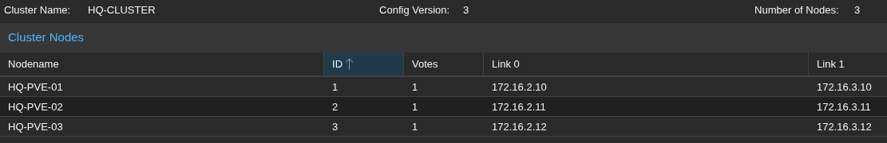

For at oprette cluster, så kører man denne command:

```bash
pvecm create HQ-CLUSTER --link0 172.16.2.10 --link1 172.16.3.10
```

Det samme kan selvfølgelig også opnås med GUI i stedet, men det er ikke sådan vi har sat dem op.

Så melder du de andre servere ind i clusteret med denne command:

```bash
# På HQ-PVE-02
pvecm add 172.16.2.10 --link0 172.16.2.11 --link1 172.16.3.11
# På HQ-PVE-03
pvecm add 172.16.2.10 --link0 172.16.2.12 --link1 172.16.3.12
```

Efter som at vi har oprettet et cluster imellem de 3 Proxmox servere, så har vi tilføjet alle det servere vi har installeret til HA (High Availability).

Her kan du se at vi har fået et par VM'er meldt ind i HA.

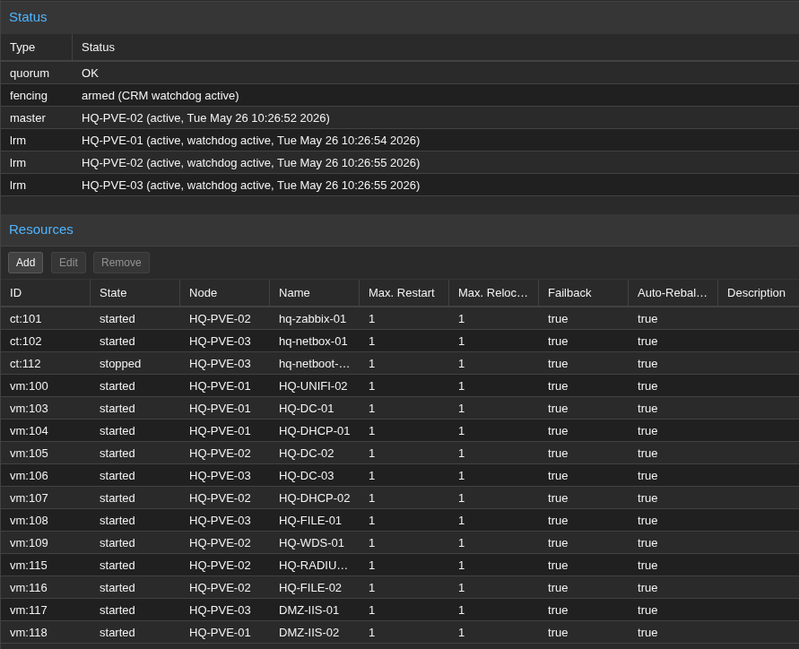

Hvis en af noderne går ned, så bliver VM'erne automatisk fordelt ud til de andre to noder efter de kommer ud a fencing mode. Fencing mode bliver brugt til at sørge for at noden rent faktisk er gået ned, før den begynder at flytte VM'erne til de andre noder.

Efter noden kommer online igen, så flytter maskinerne sig ikke automatisk tilbage der hvor den var før hen.
Der skal oprettes en Affinity Rule, for at definere hvor de forskellige VM'er bor henne.

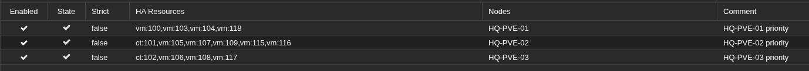

I vores tilfælde har vi lavet 3 Node Affinity Rules. En for hver host.
I de regler har vi så valgt de VM'er og containere der skal bo på den ønskede Proxmox host.

Uden affinity rules skal du manuelt migrere VM’erne tilbage hvor de var henne.

### Storage - Ceph

#### Installation
Som det første, så sørger vi for at Ceph er installeret på alle Proxmox serverne med følgende command:

```bash
pveceph install --repository no-subscription
```

Efter det er installeret, så initializerer du Ceph på HQ-PVE-01 med denne command:

```bash
pveceph init --network 172.16.0.0/24
```

Efter det er gjort, så skal monitors og managers på alle noderne:

```bash
pveceph mon create
pveceph mgr create
```

#### OSD opsætning

Efter Ceph er kommet op at køre på alle noderne, så skal vi definere OSD'erne for diskene.
Som nævnt tidligere, så kan vi ikke bruge hele disken, fordi vi har installeret Proxmox på de første 64 GB på alle diskene.

Det vi så bliver nød til at gøre er at oprette et partition med det resterende plads på disken og lave OSD'en på den.

Det gør du således:

```bash
sgdisk -n0:0:0 -t0:8300 /dev/sda
partprobe /dev/sda

pveceph osd create /dev/sda4
```

Det her skal så selvfølgelig køres på alle SSD'erne på alle Proxmox noderne

Du kan finde navnene på diskene ved at bruge denne command:

```bash
lsblk
```

#### RBD pool og CephFS storage

Efter alle OSD'erne er blevet oprettet, så kan man oprette en storage pool hvor VM'erne og containerne og en CephFS pool som bliver brugt til ISO og Templates m.m.

RDB poolen er meget nem at oprette.

```bash
pveceph pool create vm-pool --size 3 --min_size 2 --pg_autoscale_mode on --add_storages 1
```

For at sætte CephFS op, så har man brug for minimum 2 Metadata Servers (MDS).
Vi har installeret MDS på alle 3 Proxmox nodes:

```bash
pveceph mds create
```

Derefter kan CephFS så oprettes:

```bash
pveceph fs create --name cephfs --add-storage 1
```

Vi har så været inde i Datacenter &rarr; Storage og disabled de indbyggede storage muligheder (local og local-zfs).

Vi har også sørget for at det samme content er på cephfs der blev oprettet.

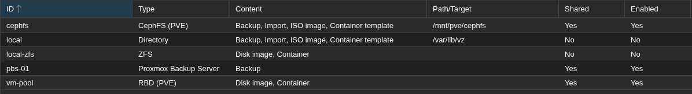

<div style="page-break-after: always;"></div>

## Backupteknologi

Den backupstrategi vi gerne ville bruge er 3-2-1-1-0.
Men som meget af det andet vi har sat op, så har vi ikke nået at implementere det hele.

Vi har valgt at installere Proxmox Backup Server og Veeam oven på en Proxmox host.
Proxmox Backup Server bliver brugt til at tage backup af VM'er og containere fra vores Proxmox cluster
Veeam tager backup af data på filserverne.

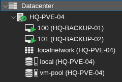

HQ-BACKUP-01 er Veeam
HQ-BACKUP-02 er Proxmox Backup Server

### Veeam

På Veeam serveren har vi at en daglig backup af data på HQ-File-01.
Backup'en kører kl. 22:00 og retention er sat til 14 dage.

Her kan du se at den har taget backup af vores folderstruktur.

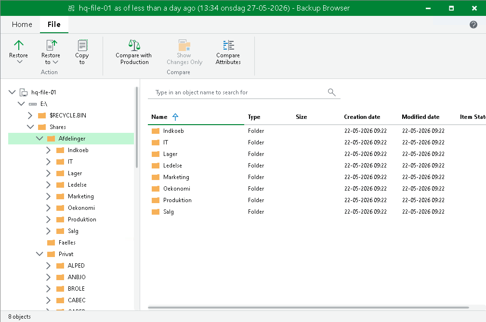

### Proxmox Backup Server

Måden vi har konfigureret en backup af vores Proxmox cluster er at tilføje den som en storage enhed på clusteret.
Derefter har vi så lavet et backup job der kører på alle serverne hver dag kl. 01:00.

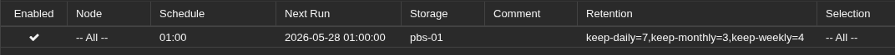

Her kan du så se de backups der er lavet:

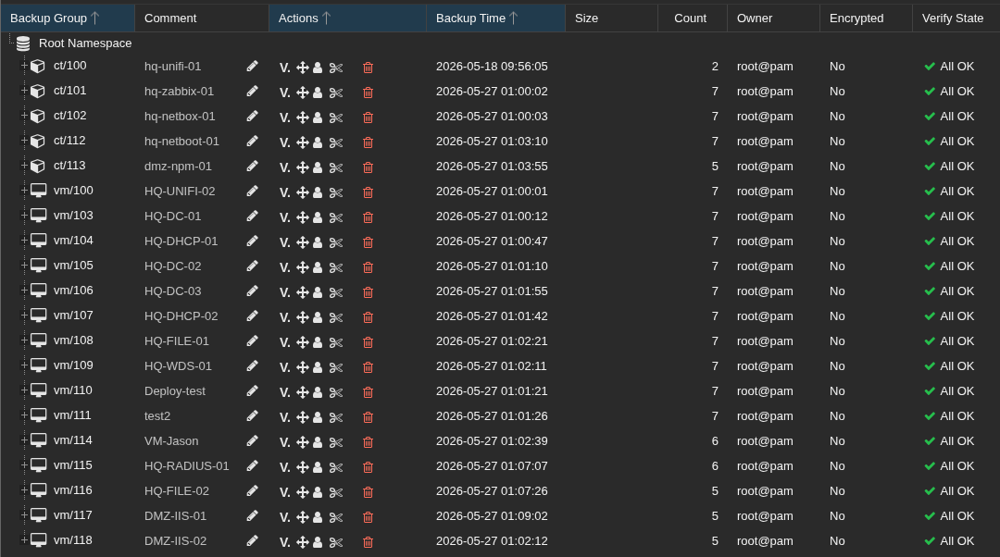

<div style="page-break-after: always;"></div>

## Cloudteknologi

Vi har ikke havt så mange muligheder for at lave noget praktisk med Cloud, uden at det skulle koste mange penge.

### Saas - Atlassian

Der er 2 produkter vi har brugt fra Atlassian: Jira Service Management (JSM) og Confluence.

JSM har vi brugt til ticket håndtering. Vi har forsøgt at sætte ticket håndteringsflowet efter ITIL.
Confluence bruger vi så til dokumentation.

Vi var i stand til at sætte Atlassian op, fordi de har et free tier til op til 3 brugere.

### IaaS - Azure / AWS / GCP

Vi var ikke i stand til at lave noget cloud computing. Men, hvis vi havde det, så havde vi nok hostet en eller to domain controllere der oppe.

<div style="page-break-after: always;"></div>

## Konklusion

Gennem dette forløb har vi forsøgt at lave den bedste løsning med de ressourcer vi havde tilgængeligt.

Vores Proxmox cluster løsning er nok den stærkeste del af vores infrastruktur.
Vi ville gerne have viderudviklet vores backupløsning til at komme tættere på en 3-2-1-1-0 løsning. Det får vi nok mulighed for til svendeprøven.

Cloud er nok den del vi har fået mindst ud af, rent praktisk. Der ville jeg have ønsket at vi havde lidt mere hands-on med cloud compute løsninger.

Alt i alt synes jeg stadig at vi har fået meget ud af det her forløb, og vi har haft mange tanker omkring hvad kunne lade sig gøre, i et firma som Prutl Solutions.